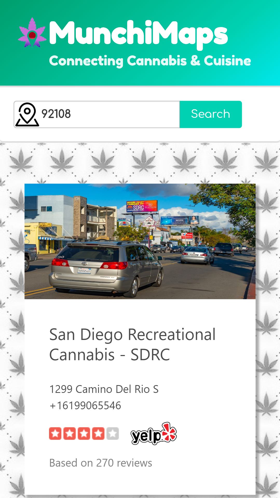

# MunchiMaps

## What is this project for?
This app was made to easily find legal dispensaries in your area and locate a restaurant close by, then giving you a google maps trip to the dispensary followed by your restaurant.

## Why did I make this project?
This prjoect was created by myself and other classmates to showcase our learning progress. We used JavaScript, jQuery, Sass, Bulma framework, Yelp API and Google Map API.

### Guide
To use this app, simply enter an address, zip code, or city you wish to search. Several dispensaries will be displayed, click on a dispensary and it will take you to a google map at the bottom of the page with several restaurant pins. Select the pin you want and press get directions. Google Maps will then open with your trip.
